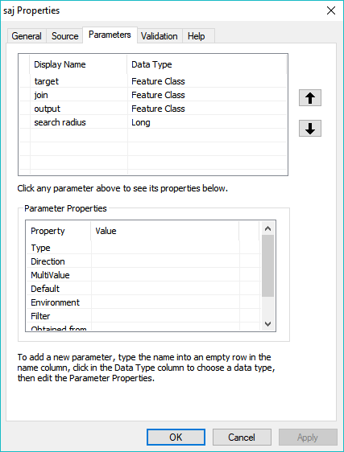
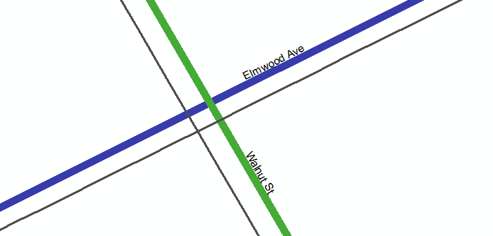
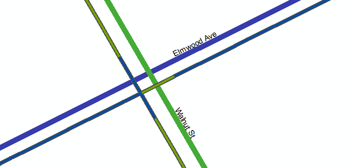
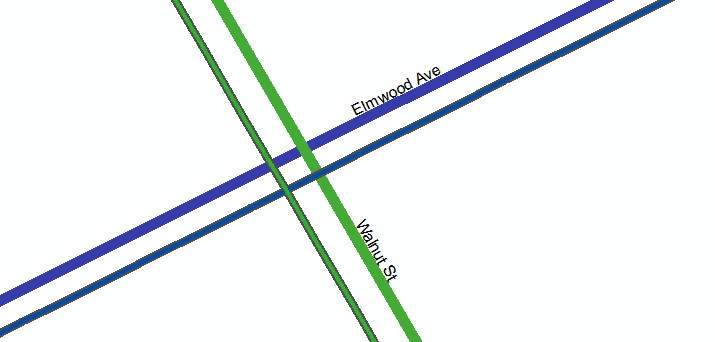

# Spatial Angle Join
Spatially joins two line features within a radius and selects the feature with the most similar polar angle.

### Requirements

ArcGIS License: Basic

### Usage

**Add it to your workflow**

```python
import saj

target = "target_features"
join = "join_features"
outupt = "output_features"
search_radius = 75 # feet

saj.spatial_angle_join(target, join, output, search_radius)
```

**Or set-up the parameters and use it as a stand alone script tool**




### Example use case

Joining road features with sanitary mains. For example a road pointing north will have an angle of 90 degrees with respect to the equator and a road pointing east will have an angle of 0 degrees because it is parallel to the equator. The sewers mostly run parallel to the road so if there is a sewer with an angle of 85 degrees it will be matched with the road going north because 85 degrees is closer to 90 degrees than 0 degrees.

Lets say you want to join the name of the roads (green and purple lines) to the sanitary mains (grey lines). 



 A normal closest spatial join would have a result like this.



This tool factors in the polar angle of the line features producing a result like this

