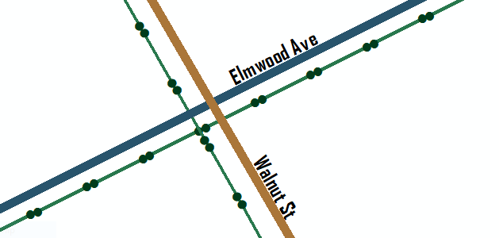
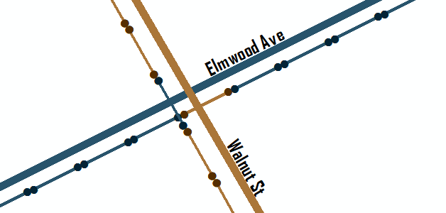
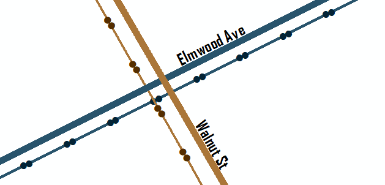

# Spatial Angle Join
Spatially joins line features within a radius and selects the feature with the most similar polar angle.

### Requirements

ArcGIS License: Basic

### Usage

**You can use it as a stand alone Python Toolbox**

**Or add it to your workflow**

```python
import arcpy

arcpy.ImportToolbox(r"path\to\the\tool\spatialanglejoin.pyt")

target = r"path\to\input\workspace.gdb\Sewer"
join = r"path\to\input\workspace.gdb\Roads"
workspace = r"path\to\workspace\workspace.gdb"
output = r"joined_by_angle" # just the name of the output features
search_radius = 75
overwriteOutput = True

arcpy.Join_saj(target, join, workspace, out_lines, search_radius, overwriteOutput)
```

### Example use case

Joining road features with sanitary mains. For example a road pointing north will have an angle of 90 degrees with respect to the equator and a road pointing east will have an angle of 0 degrees because it is parallel to the equator. The sewers mostly run parallel to the road so if there is a sewer with an angle of 85 degrees it will be matched with the road going north because 85 degrees is closer to 90 degrees than 0 degrees.

Lets say you want to join the color of the roads (blue and brown lines) to the sanitary mains (green lines). So every sewer that runs parallel (or close to parallel) to Elmwood Ave should be turned blue and every sewer that runs parallel to Walnut St should be brown.



 A normal closest spatial join would have a result like this. The problem is in the intersections. The sewers are not being associated with the parallel roads.



This tool factors in the polar angle of the line features producing a result like this. Now the sewers that run parallel to the roads are associated correctly even when they intersect.

